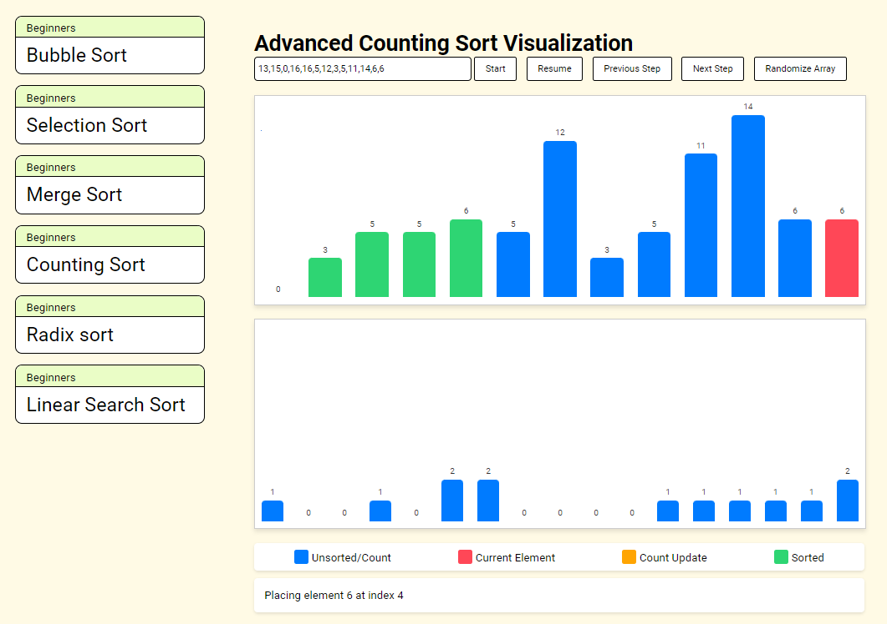
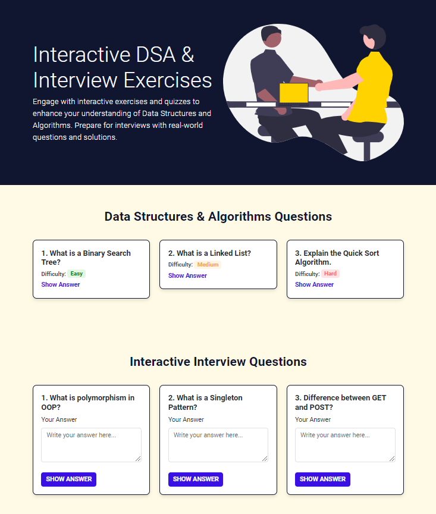
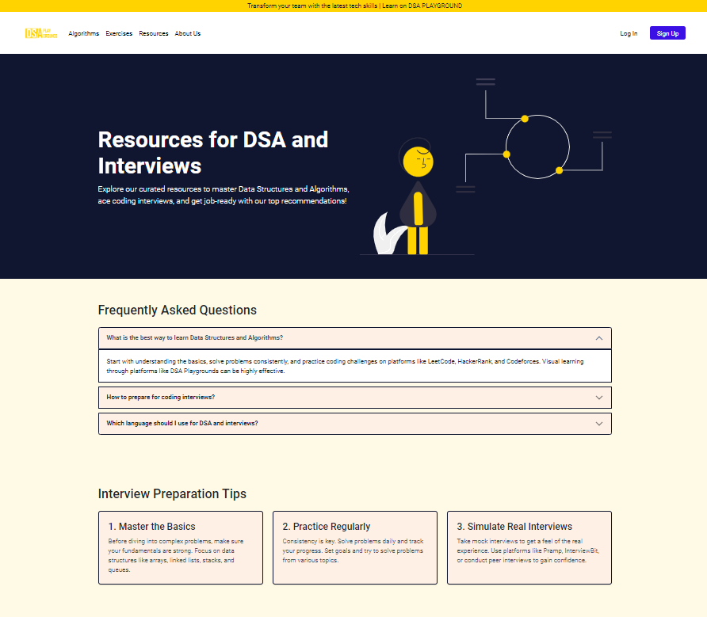

# DSA Visualization Platform - WebHorizon Hackathon (2nd Runner-up)

Welcome to the **DSA Visualization Platform**, a project developed as part of the "WebHorizon" Hackathon, where our team secured the **2nd Runner-up position** out of 98 teams. This platform aims to make Data Structures and Algorithms (DSA) easier to understand through visualizations.

## 📚 Project Overview

This platform is designed to help students grasp various **sorting algorithms** like:

- Bubble Sort
- Selection Sort
- Merge Sort
- Counting Sort
- Radix sort
- Linear Search Sort

Each algorithm is accompanied by interactive visualizations to demonstrate its step-by-step execution.

### 🔍 Features

1. **Sorting Algorithm Visualizations**: Learn popular sorting algorithms through animations.
2. **Exercise Page**: Practice your skills with exercises and **interview questions** to prepare for technical interviews.
3. **Resources Page**: Access curated learning materials, tutorials, and guides to deepen your understanding of algorithms and data structures.

### 📸 Project Screenshots

We’ve added some screenshots of the platform for a quick preview:
- ### Sorting algorithm visualization

- ### Exercise page

- ### Resources page

Check out the **Photos** section for highlights from the **prize distribution ceremony** and team pictures!

## 🚀 How to Use

To run the project locally:
1. Clone the repository: 
   \`\`\`bash
   git clone https://github.com/Jayrajsinh-Gohil/DSA-Playground
   \`\`\`
2. Navigate to the project folder:
   \`\`\`bash
   cd DSA-Visualization
   \`\`\`
3. Open the \`index.html\` file in your web browser to start exploring the visualizations and resources.

## 💡 Technologies Used

- **HTML5/CSS3**: For the frontend design and layout
- **JavaScript**: For algorithm visualizations
- **Bootstrap**: For responsive design

## 🏅 Team Members

- **Jayrajsinh Gohil**
- **Dev Tanna**
- **Naishad Gohel**

Special thanks to our mentors:
- **Tejas Sir**
- **Tirth Sir**

We are also grateful for the support and inspiration from **Dean Prof. (Dr.) Sridaran Rajagopal** and **HoD Dr. Sunil Bajeja** from the **Faculty of Computer Applications (FOCA)**.

## 🎉 Hackathon Achievements

- **Event**: WebHorizon Hackathon
- **Award**: 2nd Runner-up out of 98 teams

